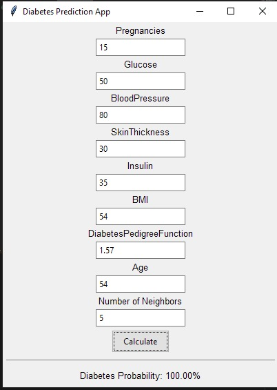

# Diabetes Probability Calculation Software

## Description

This Python desktop application calculates the probability of diabetes based on patient data input and comparison with a provided dataset.

## Requirements

- Python programming language
- Desktop application
- Data standardization
- Euclidean Distance calculation in languages Python, Rust, Go, Ruby
- Probability determination based on closest records

## Implementation Details

- Includes text boxes for entering patient information
- Performs input validation to ensure all fields are filled
- Checks if input data falls within the range of values in the dataset
- Saves preprocessed dataset to "diabetes_preprocessed.csv"
- Calculates Euclidean Distance in 8-dimensional space
- Determines probability of diabetes based on closest records

## Resources

- Sample Dataset (diabetes.csv)
- [Euclidean Distance Calculation](https://www.youtube.com/watch?v=K6Eu0kRolmA)

